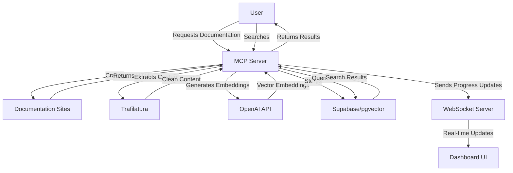

# SimpleDocs

A powerful documentation search engine that helps you find relevant information across documentation sites. Built with Python and the Model Context Protocol (MCP), it leverages trafilatura for superior content extraction, OpenAI embeddings for semantic search, and pgvector for efficient vector storage and retrieval.

## Features

- **Intelligent Content Extraction**: Uses trafilatura to extract clean, structured content from documentation sites
- **Semantic Search**: Leverages OpenAI embeddings for high-quality semantic search capabilities
- **Multi-Source Support**: Search across multiple documentation sources simultaneously
- **Real-time Progress Dashboard**: Monitor crawling and indexing progress through an interactive web dashboard
- **Automatic Content Chunking**: Handles large documents by splitting them into semantically meaningful chunks
- **Rate Limiting**: Built-in rate limiting to respect website crawling policies
- **Efficient Storage**: Uses Supabase with pgvector for optimized vector similarity search

## Architecture

The system consists of a single MCP server that integrates:
- Content crawling and extraction
- Vector embeddings generation
- Semantic search functionality
- Supabase storage integration
- WebSocket server for real-time progress updates
- Web dashboard for monitoring



## Prerequisites

- Python 3.8+
- PostgreSQL with pgvector extension
- Supabase project (for vector storage)
- OpenAI API key

## Installation

1. Clone the repository:
   ```bash
   git clone https://github.com/carloscommits/SimpleDocs.git
   cd SimpleDocs
   ```

2. Set up Python environment:
   ```bash
   cd mcp
   python -m venv .venv
   .venv\Scripts\activate  # Windows
   # Or for macOS/Linux:
   # source .venv/bin/activate
   pip install -r ../requirements.txt
   pip install "mcp[cli]"  # Required for MCP server execution
   ```

3. Set up the database:
   ```bash
   # Connect to your PostgreSQL instance
   psql -U postgres
   
   # Create a new database
   CREATE DATABASE simpledocs;
   
   # Connect to the new database
   \c simpledocs
   
   # Run the schema script
   \i /path/to/SimpleDocs/database/schema.sql
   ```

4. Set up Supabase:
   - Create a new Supabase project at https://supabase.com
   - Enable the pgvector extension in the SQL editor:
     ```sql
     CREATE EXTENSION IF NOT EXISTS vector;
     ```
   - Create the necessary tables using the schema in `database/schema.sql`
   - Get your Supabase URL and anon key from the project settings

5. Configure Cline MCP Settings:
   ```json
   {
     "mcpServers": {
       "simpledocs": {
         "command": "C:/path/to/SimpleDocs/mcp/.venv/Scripts/mcp.exe",
         "args": [
           "run",
           "C:/path/to/SimpleDocs/mcp/server.py"
         ],
         "env": {
           "OPENAI_API_KEY": "your-key-here",
           "SUPABASE_URL": "your-supabase-url",
           "SUPABASE_ANON_KEY": "your-supabase-key",
           "CRAWLER_RATE_LIMIT": "100",
           "WORKING_DIR": "C:/path/to/SimpleDocs/"
         },
         "disabled": false,
         "autoApprove": [
           "fetch_documentation",
           "search_documentation",
           "list_sources"
         ]
       }
     }
   }
   ```

   Replace the paths and environment variables with your own values:
   - Update all paths to match your SimpleDocs installation directory
   - Set your OpenAI API key
   - Set your Supabase URL and anonymous key
   - Optionally adjust the crawler rate limit (default: 100 requests per minute)

## Project Structure

```
SimpleDocs/
├── README.md                 # Project documentation
├── requirements.txt          # Python dependencies
├── database/                 # Database-related files
│   ├── README.md             # Database documentation
│   └── schema.sql            # Database schema
└── mcp/                      # MCP server implementation
    ├── server.py             # Main MCP server
    ├── services/             # Core services
    │   ├── crawler.py        # Documentation crawler
    │   ├── embeddings.py     # OpenAI embeddings generation
    │   ├── search.py         # Semantic search functionality
    │   ├── storage.py        # Supabase integration
    │   └── websocket_server.py # Real-time progress updates
    ├── dashboard/            # Progress monitoring UI
    │   ├── index.html        # Dashboard HTML
    │   ├── dashboard.css     # Dashboard styles
    │   └── dashboard.js      # Dashboard functionality
    ├── data/                 # Data storage directory
    └── logs/                 # Log files directory
```

## Available Tools

1. `fetch_documentation`
   - Crawl and index documentation from a URL
   - Parameters:
     - url: Documentation URL to crawl
     - recursive: Crawl linked pages (default: true)
     - max_depth: How deep to crawl (default: 2)
     - doc_patterns: Optional list of URL patterns to identify documentation pages

2. `search_documentation`
   - Search through indexed documentation
   - Parameters:
     - query: Search query
     - limit: Max results (default: 3)
     - min_score: Minimum similarity (default: 0.8)

3. `list_sources`
   - List all indexed documentation sources
   - Returns statistics about indexed sources including count, types, and last updated timestamp

## Usage Example

1. Enable the MCP Server in Cline:
   - Open Cline
   - Click "Configure MCP Servers"
   - Paste the configuration JSON
   - Click "Done"

2. Use the tools:
   ```
   # Crawl documentation
   fetch_documentation https://developer.bill.com/docs/home

   # Search content
   search_documentation "authentication"

   # List sources
   list_sources
   ```

3. Monitor Progress:
   - When you run `fetch_documentation`, a dashboard will automatically open in your browser
   - The dashboard shows real-time progress of crawling, processing, and embedding
   - You can see statistics like URLs discovered, processed, and chunks created

## How It Works

### Document Processing Pipeline

1. **Crawling**: The system crawls documentation sites starting from a specified URL
   - Follows links recursively up to the specified depth
   - Identifies documentation pages based on URL patterns
   - Respects rate limits to avoid overloading servers

2. **Content Extraction**: Clean content is extracted from HTML
   - Uses trafilatura for high-quality content extraction
   - Falls back to custom extraction for API documentation
   - Preserves document structure and metadata

3. **Content Chunking**: Large documents are split into manageable chunks
   - Documents exceeding the token limit (8100 tokens) are automatically split
   - Each chunk includes the document title for context
   - Chunks are tracked and processed independently

4. **Embedding Generation**: Vector embeddings are created for each document/chunk
   - Uses OpenAI's text-embedding-ada-002 model (1536 dimensions)
   - Processes documents in batches for efficiency
   - Includes error handling and retry logic

5. **Storage**: Documents and embeddings are stored in Supabase
   - Uses pgvector for efficient vector similarity search
   - Tracks document metadata including source, type, and section
   - Handles updates to existing documents

### Real-time Progress Monitoring

The system includes a WebSocket server and web dashboard for monitoring crawling progress:

- **WebSocket Server**: Provides real-time updates on crawling progress
  - Tracks URLs discovered, crawled, and processed
  - Reports on document chunks created and embedded
  - Maintains state between sessions

- **Dashboard UI**: Visual interface for monitoring progress
  - Shows real-time statistics and progress bars
  - Lists processed URLs
  - Displays elapsed time and current activity

## Database Structure

The system uses PostgreSQL with the pgvector extension for storing and searching document embeddings:

### Documents Table
```sql
documents (
    id uuid PRIMARY KEY,           -- Unique identifier
    url TEXT NOT NULL,             -- Source URL of the document
    title TEXT,                    -- Document title
    content TEXT NOT NULL,         -- Document content
    embedding vector(1536),        -- OpenAI embedding vector
    source_domain TEXT NOT NULL,   -- e.g., 'bill.com', 'stripe.com'
    doc_type TEXT NOT NULL,        -- e.g., 'api', 'guide', 'reference'
    doc_section TEXT,              -- e.g., 'authentication', 'endpoints'
    parent_url TEXT,               -- For hierarchical relationships
    version INTEGER DEFAULT 1,     -- Document version
    created_at TIMESTAMPTZ,        -- Creation timestamp
    updated_at TIMESTAMPTZ         -- Last update timestamp
)
```

### Database Functions

1. **Source Statistics**: `get_source_stats()`
   - Returns statistics about indexed documentation sources

2. **Source-Specific Search**: `search_source_documents()`
   - Searches within a specific documentation source

3. **General Search**: `match_documents()`
   - Searches across all documentation sources

## Troubleshooting

1. MCP Server Issues
   - Verify Python virtual environment is activated
   - Check all required packages are installed
   - Ensure MCP CLI is installed (`pip install "mcp[cli]"`)
   - Verify paths in MCP settings are correct
   - Check log files in the `mcp/logs/` directory

2. Crawling Issues
   - Check URL is accessible
   - Verify recursive and max_depth settings
   - Look for rate limiting messages
   - Check CRAWLER_RATE_LIMIT setting
   - Inspect the dashboard for detailed progress information

3. Search Problems
   - Ensure content has been crawled first
   - Check Supabase connection
   - Verify OpenAI API key is valid
   - Check embeddings are being generated
   - Verify pgvector extension is enabled in your database

## Development

The project is organized into services:
- `crawler.py`: Content extraction and crawling
- `embeddings.py`: Vector embedding generation
- `storage.py`: Supabase integration
- `search.py`: Semantic search functionality
- `server.py`: MCP server implementation
- `websocket_server.py`: Real-time progress updates
